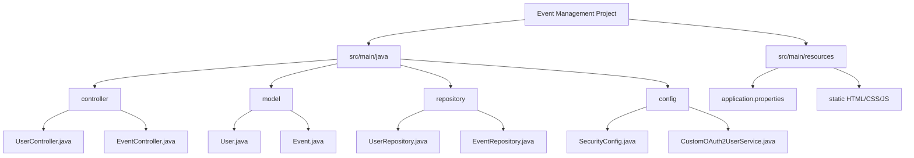
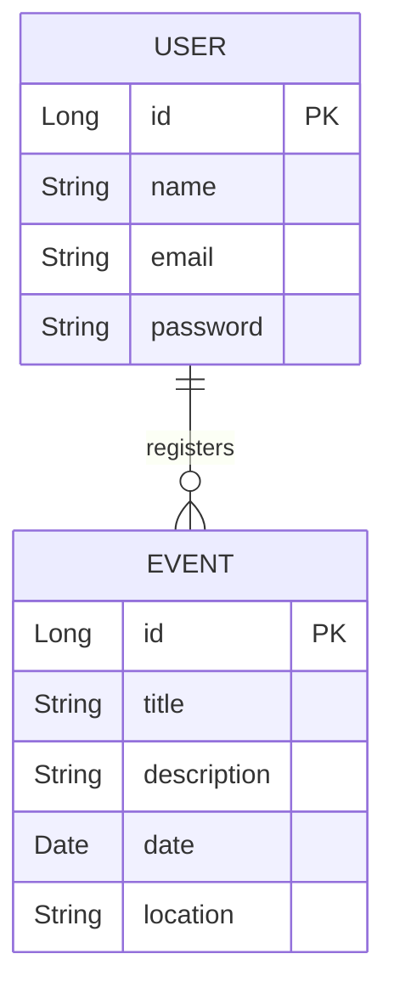

# Event Management System (Spring Boot + MySQL + Google OAuth2)

A **Spring Boot-based Event Management System** that allows users to register, log in (via email/password or Google OAuth2), and register for events.  
The backend is fully functional, with REST APIs tested successfully using **Postman**.  
⚠️ The frontend integration is incomplete.

---

## 🚀 Features
- **User Authentication**
  - Email/Password-based registration & login
  - Google OAuth2 login
- **Event Management**
  - View available events
  - Register for events
  - Track events attended
- **Database Integration**
  - MySQL database for persistent storage
- **Secure APIs**
  - Protected endpoints using Spring Security

---

## 📂 Project Structure

🛠 Tech Stack
Backend: Spring Boot (v3.5.3)
Database: MySQL
Security: Spring Security, OAuth2 (Google)
Build Tool: Maven
Testing: Postman (API testing)

⚙ Setup Instructions
1️⃣ Clone the Repository
git clone https://github.com/Kishore4739/event-management.git
cd event-management

2️⃣ Configure Database
Create MySQL Database:
CREATE DATABASE event_db;
Update credentials in application.properties:
spring.datasource.url=jdbc:mysql://localhost:3306/event_db
spring.datasource.username=root
spring.datasource.password=YOUR_PASSWORD

3️⃣ Configure Google OAuth2
Create a project in Google Developer Console
Get Client ID & Secret Key
Update in application.properties:
spring.security.oauth2.client.registration.google.client-id=YOUR_CLIENT_ID
spring.security.oauth2.client.registration.google.client-secret=YOUR_SECRET

4️⃣ Run the Project
mvn spring-boot:run

The application will start at:
👉 http://localhost:8080

🔑 API Endpoints
User APIs
| Method | Endpoint                             | Description                   |
| ------ | ------------------------------------ | ----------------------------- |
| POST   | `/api/users/register`                | Register a new user           |
| POST   | `/api/users/login`                   | Login existing user           |
| GET    | `/api/users/me`                      | Get logged-in user info       |
| POST   | `/api/users/registerEvent/{eventId}` | Register for an event         |
| GET    | `/api/users/eventsAttended`          | Get number of events attended |

Event APIs
| Method | Endpoint                 | Description                     |
| ------ | ------------------------ | ------------------------------- |
| GET    | `/api/events`            | Get all available events        |
| GET    | `/api/events/registered` | Get events registered by a user |

Backend APIs tested successfully on Postman.
Frontend integration is pending (HTML/CSS prepared, but API calls not fully connected).
Repo contains complete backend logic with working DB & OAuth2 configuration.

📷 ER Diagram

Conclusion
This backend project demonstrates:
Working user authentication
Secure API development
Database integration with Spring JPA
OAuth2 login handling

